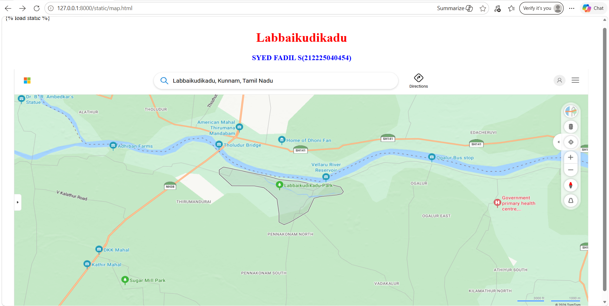
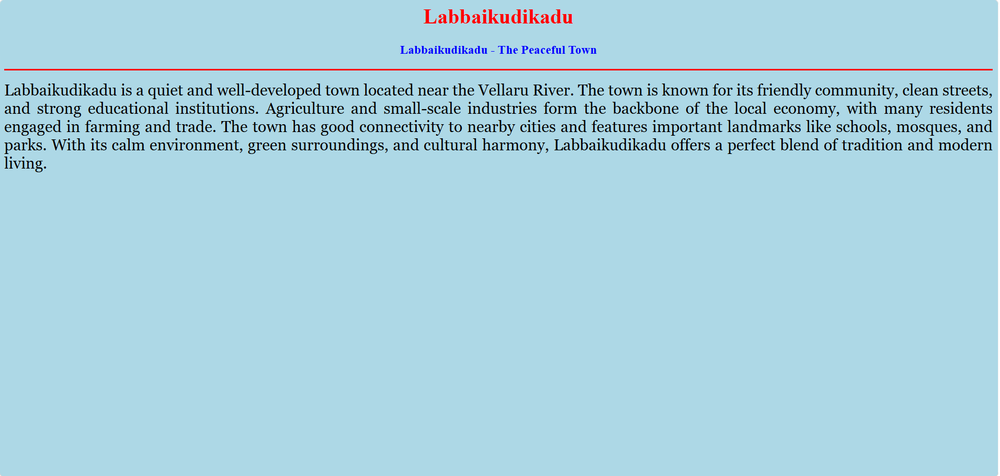
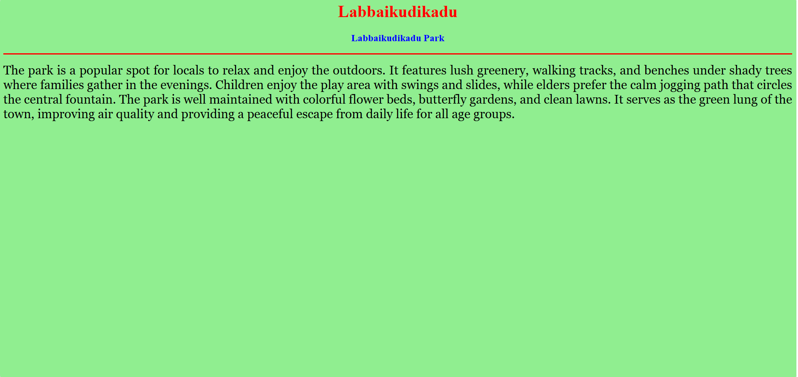
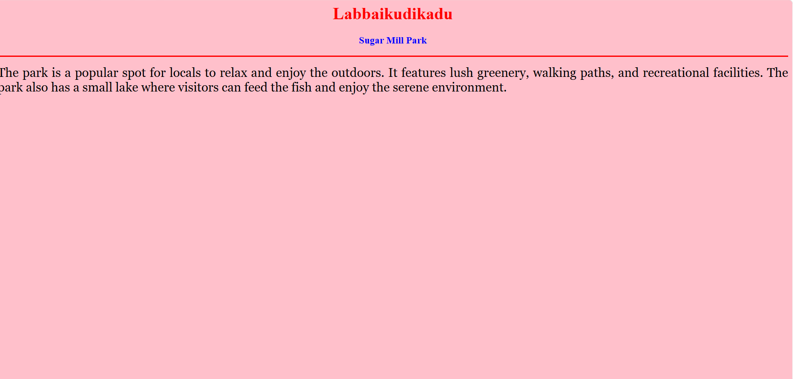

# Ex03 Places Around Me
## Date: 21/06/2026

## AIM
To develop a website to display details about the places around my house.

## DESIGN STEPS

### STEP 1
Create a Django admin interface.

### STEP 2
Download your city map from Google.

### STEP 3
Using ```<map>``` tag name the map.

### STEP 4
Create clickable regions in the image using ```<area>``` tag.

### STEP 5
Write HTML programs for all the regions identified.

### STEP 6
Execute the programs and publish them.

## CODE:

map.html
```

<html>
<head>
    <title>My City</title>
</head>
<body>
    <h1 align="center">
        <font color="red"><b>Labbaikudikadu</b></font>
    </h1>
    <h3 align="center">
        <font color="blue"><b>SYED FADIL S(212225040454)</b></font>
    </h3>
    <center>
        
        <map name="MyCity">
            <area shape="rect" coords="720,300,920,400" href="home.html" title="My Home Town">
            <area shape="circle" coords="320,520,20" href="sugarmill.html" title="Sugar mill park">
            <area shape="rect" coords="720,260,920,360" href="park.html" title="Labbaikudikadu Park">
        </map>
    </center>
</body>
</html>
```
home.html
```
<html>
<head>
    <title>My Home Town</title>
</head>
<body bgcolor="lightblue">
    <h1 align="center">
        <font color="red"><b>Labbaikudikadu</b></font>
    </h1>
    <h3 align="center">
        <font color="blue"><b>Labbaikudikadu - The Peaceful Town</b></font>
    </h3>
    <hr size="3" color="red">
    <p align="justify">
        <font face="Georgia" size="5">
            Labbaikudikadu is a quiet and well-developed town located near the Vellaru River.
            The town is known for its friendly community, clean streets, and strong educational
            institutions. Agriculture and small-scale industries form the backbone of the local 
            economy, with many residents engaged in farming and trade. The town has good connectivity
            to nearby cities and features important landmarks like schools, mosques, and parks.
            With its calm environment, green surroundings, and cultural harmony, Labbaikudikadu offers
            a perfect blend of tradition and modern living.
        </font>
    </p>
</body>
</html>
```
park.html
```
<html>
<head>
    <title>My Home Town</title>
</head>
<body bgcolor="lightgreen">
    <h1 align="center">
        <font color="red"><b>Labbaikudikadu</b></font>
    </h1>
    <h3 align="center">
        <font color="blue"><b>Labbaikudikadu Park</b></font>
    </h3>
    <hr size="3" color="red">
    <p align="justify">
        <font face="Georgia" size="5">
            The park is a popular spot for locals to relax and enjoy the outdoors. It features lush greenery, walking tracks, and benches under shady trees where families gather in the evenings. Children enjoy the play area with swings and slides, while elders prefer the calm jogging path that circles the central fountain. The park is well maintained with colorful flower beds, butterfly gardens, and clean lawns. It serves as the green lung of the town, improving air quality and providing a peaceful escape from daily life for all age groups.
        </font>
    </p>
</body>
</html>
```
sugarmill.html
```
<html>
<head>
    <title>My Home Town</title>
</head>
<body bgcolor="pink">
    <h1 align="center">
        <font color="red"><b>Labbaikudikadu</b></font>
    </h1>
    <h3 align="center">
        <font color="blue"><b>Sugar Mill Park</b></font>
    </h3>
    <hr size="3" color="red">
    <p align="justify">
        <font face="Georgia" size="5">
            The park is a popular spot for locals to relax and enjoy the outdoors. It features lush greenery, walking paths, and recreational facilities. The park also has a small lake where visitors can feed the fish and enjoy the serene environment.
        </font>
    </p>
</body>
</html>
```


## OUTPUT










## RESULT
The program for implementing image maps using HTML is executed successfully.
